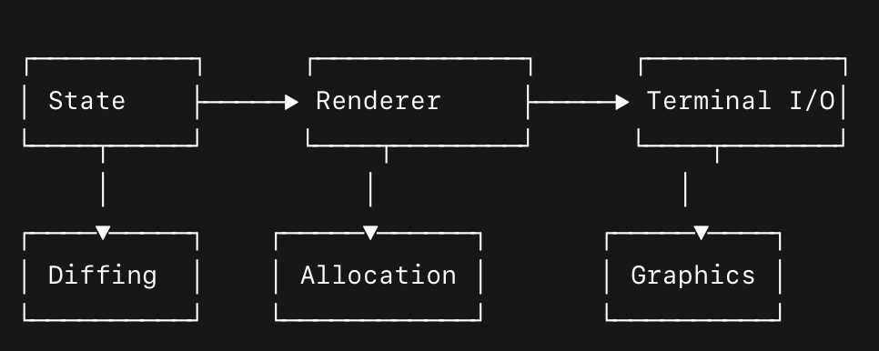

# Pakkit (In Progress)

Pakkit is a reactive framework for building expressive, animated, and stateful CLI applications. Think React-style components meet game engine render loops, all optimized for the terminal. I designed Pakkit for three primary reasons:

1. I like the terminal .
2. Terminal apps should be easier to build.
3. I'm building a terminal app...

### Philosophy

Pakkit is built around five core principles:

- **Composability** - All elements drawn to the screen are composable _Renderables_ and declarative. What you layout is what you get.
- **Reactivity** – Your app responds to state changes declaratively.
- **Simple Rendering** – Time-based render updates and diffing designed to be as simple and straightforward as possible.
- **Animatable** – Seamless animation without blocking logic or I/O.
- **Screen Ownership** – Reserve screen real estate for dynamic elements.

### Quickstart (In-Progess)

Pakkit isn't yet on the Python package market, but will be shortly. Setup will look something like this:

```bash
$ pip install pakkit  # hypothetical instal
```

```python
from pakkit import Engine, Scene

engine = Engine()
engine.scenes.define({
            "home": Scene(
                [
                    TypedText("Hello, welcome home!", delay=1),
                    Animatable(fps=60, defer_render=False).alloc(15),
                    Question("What's your favorite music genre?").on(
                        {
                            "metal": Selection(
                                "Favorite sub-genre?",
                                choices=["djent", "black", "power"],
                            ),
                            "pop": [
                                TypedText("Are you serious?! Pop Sucks!", 0.02),
                                Question("Tell me what you like about pop lol").on(
                                    {"": TypedText("Odd, I hate pop")}
                                ),
                            ],
                        }
                    ),
                    TypedText("This is the end.. my only friend, the end..").then(
                        lambda renderable: print(
                            f"Goodbye... from {renderable.__class__.__name__}"
                        )
                    ),
                ]
            ),
            "playback": Scene([TypedText("Welcome to the playback scene!")]),
        })
engine.start()
```

this instantiates the engine, and registers two scenes "home" and "playback" with their respective _Renderable_ layouts, then starts the engine in its own thread.

### Architecture Overview

Pakkit consists of tightly coupled subsystems:


Each subsystem has a defined role:

- State: Global app state, reactive updates.
- Renderer: Diffs and re-renders terminal output.
- Engine: Core loop + timing + animation system.
- Allocator: Reserves screen space for animated elements.
- Input: Event-driven user input.
- Graphics: ASCII layout primitives.
- Events: Custom dispatch system for coordination.

Every element that makes it to the screen via the renderer is a _Renderable_. Renderables are a core primitive within the framework, they can easily be extended and subclassed for custom behavior, but the Pakky provides many out of the box.

### Core Concepts

1. 🌀 Engine – The Render Loop
   ```python
   engine = Engine(state)
   engine.start()
   ```
   Runs the main render loop.
   Coordinates updates, timing, and dispatches animation ticks.
   Hooks into renderables and input stream.
2. 🧠 State – Reactive Global Store
   ```python
   state.set("level", 1)
   state.get("level") # "automatically subscribes caller to changes using meta programming"
   ```
   Automatically triggers re-renders.
   Deep merge support for nested updates.
3. 🖼 Renderer – Diffs + Redraw
   ````python
   renderer = Renderer(state) # don't do this, just an example
   renderer.render()```
   Only redraws changed lines via ANSI diffing.
   Supports layered rendering and allocation-aware blocks.
   ````
4. ⬛️ Allocator – Reserve CLI Screen Space

```python
# allocating space for an animatable - renderable which has built in alloc utilities
anim = sine_wave(fps=60, defer_render=False)
anim.alloc(15) # allocate 15 lines from draw line/row start

# allocating space manually without a renderable
alloc(15, 2, auto=True) # allocates 15 lines starting from row 2. If allocation collides with registered allocation, auto=True finds the next available row start which can contain the size 15 offset.
```

Used for dynamic regions like loaders and animations.
Engine skips over allocated regions when diffing.

5. 🎭 Graphics – Drawing Primitives

```python
from packy.Graphics import Graphics, Point, Line

gfx = Graphics()
while True:
    line = Line(Point.origin(), Point(12, 12))
    for point in line:
        gfx.move(point).draw("*")
    gfx.render()
```

here's a more involved example:

```python
from pakky import Graphics as gfx

def random_falling_star():
    Graphics.reposition_cursor()
    gfx = gfx.Graphics()

    start_height = 15
    current_pos = Point.origin()
    for i in range(10):
        gfx.move(current_pos).draw("⭐️").render()
        current_pos += gfx.Point.rand_point(start_height - i)
        gfx.reset_buffer()
        gfx.clear_screen()
        Graphics.commit()
        time.sleep(0.8)
```

and here's an example using the Animation block utility that handles screen clearing and flushing safely:

```python
from pakky import Animation

def request_anim_test():
    def render_animated_sine_wave(ctx):
        for x in range(ctx["width"]):
            y = ctx["offset_y"] + int(
                ctx["amplitude"] * math.sin(ctx["scale_x"] * x + ctx["phase"])
            )
            ctx["gfx"].move(Point(x, y)).draw("*")
        ctx["gfx"].render()
        ctx["phase"] += ctx["speed"]

    swave = Animation.Animatable(
        render_animated_sine_wave,
        width=80,
        amplitude=8,
        offset_y=10,
        speed=0.2,
        scale_x=0.3,
        phase=0,
    )

    anim_block = Animation.request_frame(swave)
    anim_block.start()
    time.sleep(5)
    anim_block.stop()
    print("Animation finished")
```

- Declarative rendering API.
- ANSI styling + layout.

6. ⌨️ InputStream – Keyboard Events
   from io import InputStream

```python
count = 0
def on_input(data):
    print("INPUT: ", data)

stream = InputStream()
stream.on(on_input)
stream.start()
while count < 10:
    count += 1
    time.sleep(0.5)
stream.stop()
```

- Non-blocking input handling.
- Listener/dispatch model.

7. 📦 Renderable + Animatable

```python
class BootupLogsDisplay(TypedBlock):
    def __init__(self):
        super().__init__(
            db["scenes"]["bootup"]["logs"], hide_after_render=False, static=True
        )
        return

    def cached_render(self):
        return "\n".join(self.lines)


class BarSpinnerDisplay(Renderable):
    def __init__(self):
        super().__init__(readable=False)
        return

    def render(self):
        self.disabled = True
        return utils.bar_spinner("$: ", 0.05)

# then use theme in a scene layout
home_scene: Scene = Scene(
            [
                LogoDisplay(),
                BootupCreditsDisplay(),
                BootupLogsDisplay(),
                BarSpinnerDisplay(),
            ]
        )
```

### 🧼 Diffing Engine
Pakkit’s diffing engine is a line-level, hash-based reconciliation system that compares screen frames to efficiently update the terminal. It's designed to work invisibly under the hood, enabling a declarative developer experience while optimizing for performance. Rather than redrawing the entire screen each frame—which would cause flickering, inefficiency, and visual noise—it intelligently determines only what has changed and updates those lines.
This diffing system integrates seamlessly with the Renderer, which acts as the orchestrator of all visual updates.

To avoid expensive string-by-string comparisons, Pakkit computes a hash for each line in the rendered output. When comparing two frames (previous vs. current):
Each line is hashed, typically using a simple, fast algorithm.
Hashes are compared to detect whether a line has changed.
If the hash differs, the renderer issues a terminal instruction to redraw the line.
If the hash is the same, the line is skipped.
This means Pakkit avoids unnecessary processing and rendering, leading to fast UI updates even for complex CLI apps.

Key Principles: 
- Uses a CRC32 checksum hash mechanism, used to efficiently detect changes between frames at the line level.
- Selective redraw: Only lines that have changed are reprinted to the terminal using ANSI cursor movement, ensuring efficiency and smooth updates.
Renderables are pure functions: Each renderable returns a representation of what it wants the screen to look like. The diffing layer takes care of translating that into terminal output instructions.
- Allocator-aware: The diffing engine respects reserved terminal regions defined by the Allocator, skipping over dynamic or animated blocks that manage their own rendering.

Why CRC32?
- Fast: CRC32 is extremely quick to compute and well-suited for hashing short strings (like terminal lines).
- Consistent: It produces a reliable 32-bit integer representation of each line.
- Efficient comparison: Rather than comparing full strings, the engine compares CRC32 hashes to detect changes.

### 🧪 Testing & Debugging (In progress)
Use .render() manually from components to test output:
print(RenderableObject().render())
Or run:
python main.py
📁 Project Structure
.
├── engine.py # Render loop + ticking
├── state.py # Reactive state management
├── renderer.py # Diffing and render pipeline
├── io.py # InputStream listener system
├── events.py # Dispatch and animation loop base
├── graphics.py # Rects, text, and drawing primitives
├── allocator.py # Allocation and block registration
├── primitives.py # Base Renderable, Animatable, Tickable
├── diffing.py # Diff algorithm for efficient redraw
└── main.py # Sample application

### 🧩 Extend & Compose
Custom renderables, animations, and state bindings can be composed like UI widgets. You can:
Build CLI dashboards
Create animated UIs
Hook into real-time input
Build text games or editors

### 🔧 Coming Soon
Mouse input support
Scrollable panels
Themes + style tokens
Templated layouts

### 🛠 License
MIT © 2025 — Built with ❤️ for terminal lovers.
